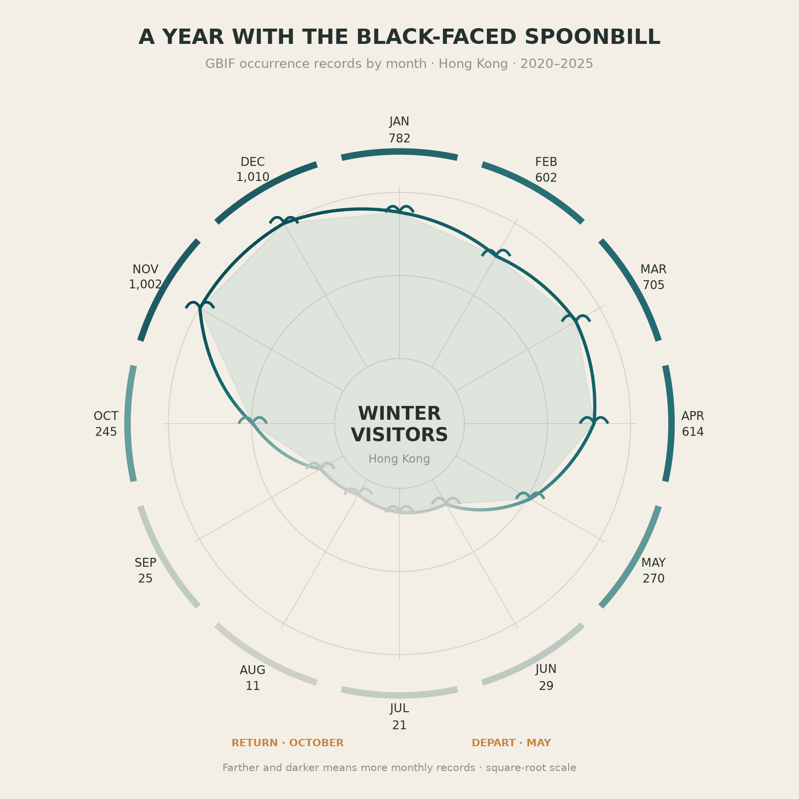

# Seasonal observations of Black-faced Spoonbills in Hong Kong




## The phenomenon
Black-faced Spoonbills are migratory waterbirds that spend much of the winter in Hong Kong. I wanted to see when their recorded season arrives, reaches its peak and fades across the year. I therefore compared occurrence records from the six complete years from 2020 to 2025. Turning the twelve months into a circular calendar makes the annual cycle visible as one continuous shape rather than twelve separate charts.

## The source

The data comes from the [GBIF occurrence download](https://www.gbif.org/occurrence/download/0001661-260916113435855). The archive contains 8,235 occurrence records for *Platalea minor* in Hong Kong between 1981 and 2026. Each row represents one published occurrence record, not necessarily one individual bird. I used the year, month, decimal latitude and decimal longitude fields. Coordinates are measured in decimal degrees, and the analysis keeps 5,316 records from the complete years 2020–2025.

## What the picture shows

The angle around the circle represents the month, while distance from the centre represents the monthly record count on a square-root scale. The bird silhouettes sit farther from the centre and become darker when records are more numerous. The picture shows a strong seasonal pattern: records rise in October, exceed 1,000 in November and December, remain high through April, and fall to very low levels from June to September. The chart shows reported occurrences rather than the true bird population: observation effort varies and repeated visits may create multiple records.

## Run it

```
uv run fetch.py
uv run plot.py
```
